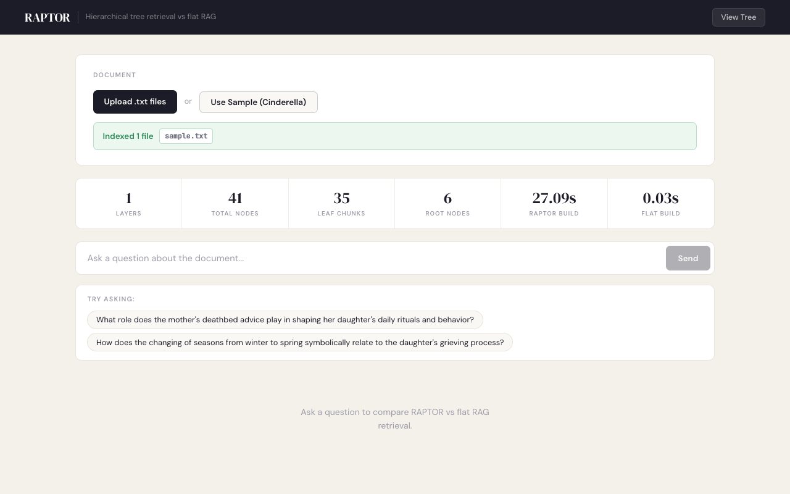
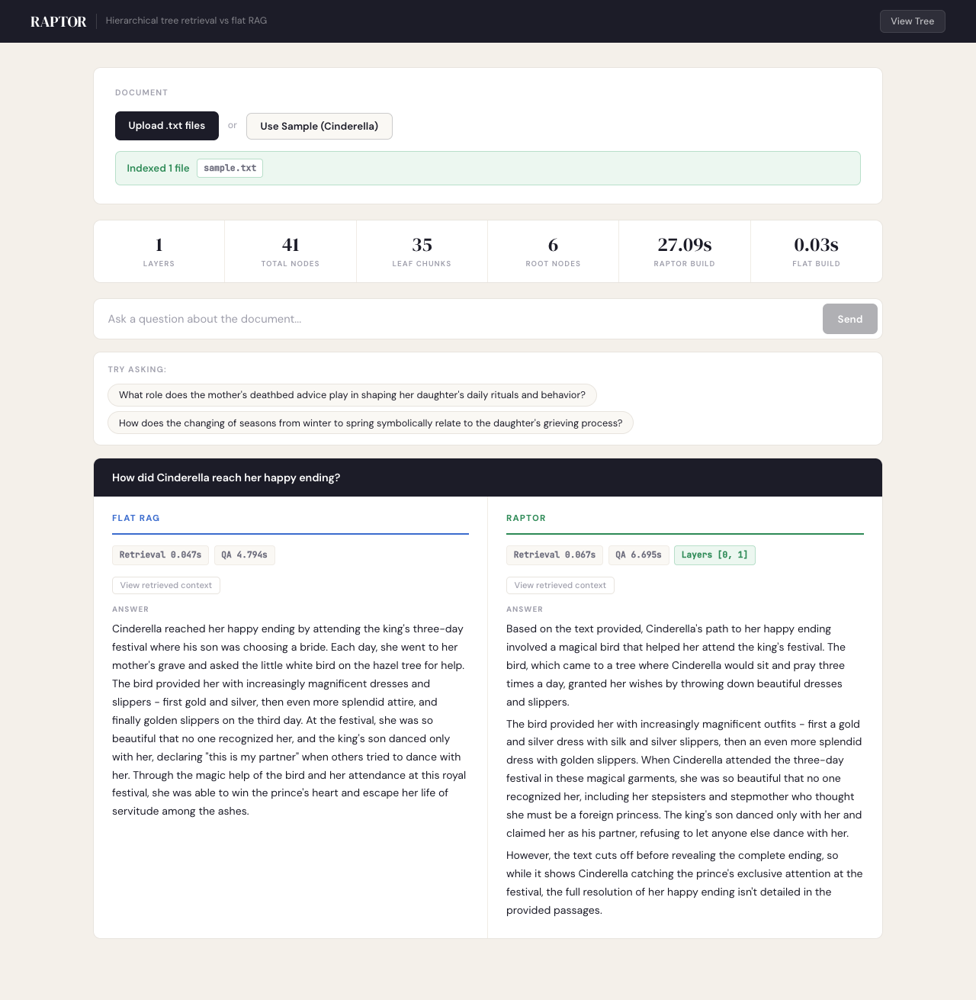
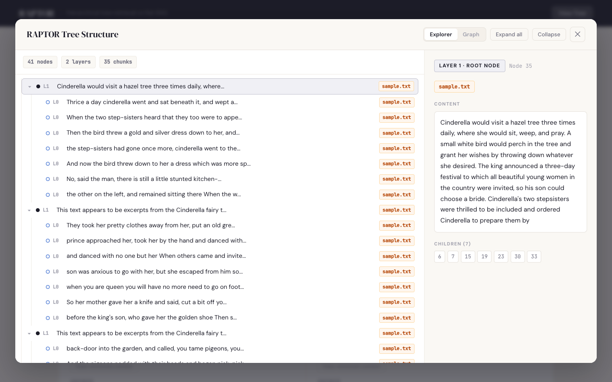
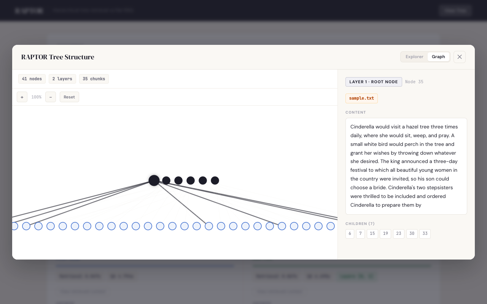

<picture>
  <source media="(prefers-color-scheme: dark)" srcset="raptor_dark.png">
  
</picture>

## RAPTOR: Recursive Abstractive Processing for Tree-Organized Retrieval

RAPTOR builds a **recursive tree** from documents — clustering and summarizing chunks at multiple levels — then retrieves from the full hierarchy at query time. This gives the LLM both fine-grained details and high-level context that flat RAG misses.

> Based on the [original paper](https://arxiv.org/abs/2401.18059) by Sarthi et al. (ICLR 2024)

### What's improved over the original

- **Beam search retrieval** — explores parallel branches in the tree instead of following a single path, so relevant nodes in sibling clusters aren't missed
- **Chunk overlap** — 10% token overlap between chunks preserves context at boundaries (original had zero overlap)
- **Bug fixes** — fixed threshold comparison (was selecting dissimilar nodes), float precision in clustering (caused silent node misassignment), and a race condition in parallel tree building
- **Adaptive clustering** — scales BIC search and UMAP neighbors with document size instead of hardcoded limits
- **React dashboard** — upload documents, compare RAPTOR vs flat RAG side-by-side, explore the tree visually
- **Multi-file support** — upload multiple files with per-node source tracking
- **Benchmark tooling** — CLI scripts for RAPTOR vs flat FAISS comparison

---

## Dashboard

Upload documents, ask questions, and see **RAPTOR vs flat RAG** answers side-by-side. Explore the tree structure with an interactive explorer and zoomable graph.

```bash
# Backend
cd dashboard/backend && pip install flask flask-cors && python app.py

# Frontend
cd dashboard/frontend && npm install && npm run dev
```

Open **http://localhost:5173**

### Upload & Stats



### Side-by-side Results



### Tree Explorer



### Graph View



---

## Quick Start

```bash
git clone https://github.com/viplismism/raptor.git
cd raptor
pip install -e ".[all]"
```

Create a `.env` file (see `.env.example`):

```
ANTHROPIC_API_KEY=sk-ant-...
OPENAI_API_KEY=sk-...          # optional, for OpenAI embeddings
```

```python
from raptor import RetrievalAugmentation

RA = RetrievalAugmentation()

with open('demo/sample.txt', 'r') as file:
    RA.add_documents(file.read())

answer = RA.answer_question("How did Cinderella reach her happy ending?")
```

### Saving and Loading Trees

```python
RA.save("demo/cinderella")
RA = RetrievalAugmentation(tree="demo/cinderella")
```

### Custom Models

Extend the base classes to plug in any model:

```python
from raptor import (
    BaseSummarizationModel, BaseQAModel, BaseEmbeddingModel,
    RetrievalAugmentation, RetrievalAugmentationConfig,
)

class MySummarizer(BaseSummarizationModel):
    def summarize(self, context, max_tokens=150):
        return "your summary"

class MyQA(BaseQAModel):
    def answer_question(self, context, question):
        return "your answer"

class MyEmbedding(BaseEmbeddingModel):
    def create_embedding(self, text):
        return [0.0] * 768

config = RetrievalAugmentationConfig(
    summarization_model=MySummarizer(),
    qa_model=MyQA(),
    embedding_model=MyEmbedding(),
)
RA = RetrievalAugmentation(config=config)
```

### Install Extras

| Extra       | What it adds                                  |
|-------------|-----------------------------------------------|
| `openai`    | OpenAI models for embeddings                  |
| `sbert`     | Sentence-Transformers embeddings              |
| `local`     | Local T5/UnifiedQA (torch + transformers)     |
| `faiss`     | FAISS flat retrieval baseline                 |
| `benchmark` | Benchmark CLI                                 |
| `all`       | Everything above                              |

```bash
pip install -e ".[sbert,faiss]"   # pick what you need
```

### Benchmarking

```bash
python -m benchmarks.run_benchmark \
    --document demo/sample.txt \
    --questions "How did Cinderella reach her happy ending?"
```

```python
from raptor import RaptorBenchmark

report = RaptorBenchmark().run(text, ["How did Cinderella reach her happy ending?"])
print(report.summary())
```

See `notebooks/demo.ipynb` for interactive examples.

---

## Acknowledgements

Based on the original [RAPTOR implementation](https://github.com/parthsarthi03/raptor) by Parth Sarthi et al. This fork adds modular code structure, a React dashboard, multi-file support, and benchmark tooling.

## Citation

```bibtex
@inproceedings{sarthi2024raptor,
    title={RAPTOR: Recursive Abstractive Processing for Tree-Organized Retrieval},
    author={Sarthi, Parth and Abdullah, Salman and Tuli, Aditi and Khanna, Shubh and Goldie, Anna and Manning, Christopher D.},
    booktitle={International Conference on Learning Representations (ICLR)},
    year={2024}
}
```

## License

MIT
